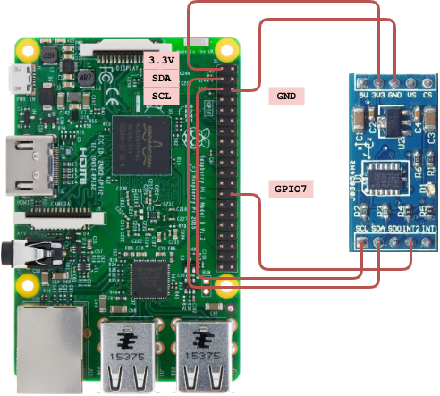

# I2C 101



This work shows how to use `I2C` to interact with [ADXL345](https://www.analog.com/media/en/technical-documentation/data-sheets/ADXL345.pdf).

## Prerequisite

- RPi3 I2C Interface Enabled
- Python Dependency
  - [`RPi.GPIO`](https://pypi.org/project/RPi.GPIO)
  - [`smbus`](https://pypi.org/project/smbus)

## Run

```shell
python main.py
```

After execution it will do the following things:

- Register a callback to print interrupt type when `GPIO7` got falling
- Enable `ADXL345` interrupt when activity and inactivity with threshold 1.25g
- Set `ADXL345` interrupt map from activity and inactivity to falling `INT2`, which is connected to `GPIO7` and will trigger the callback
